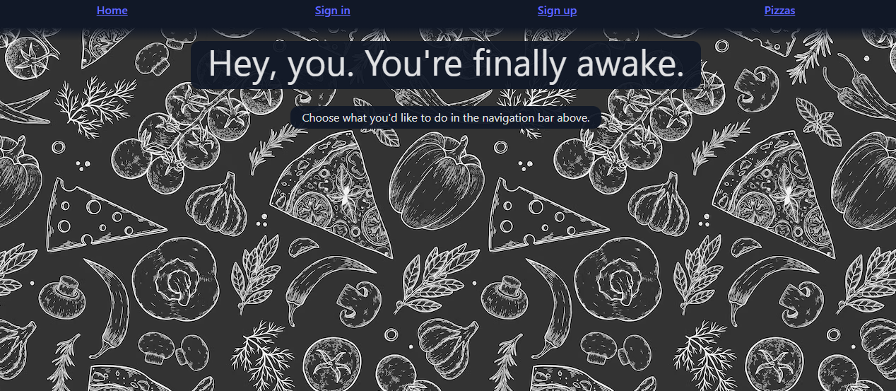
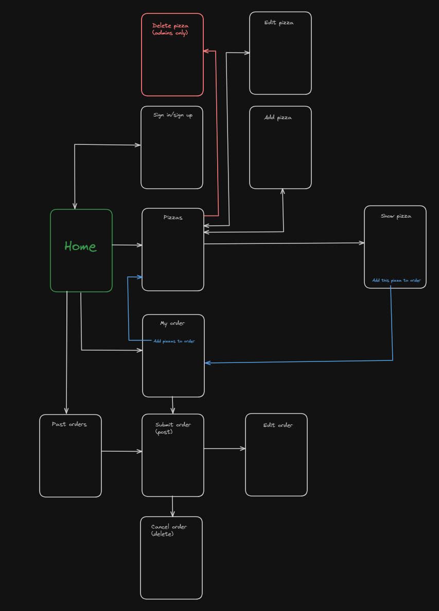
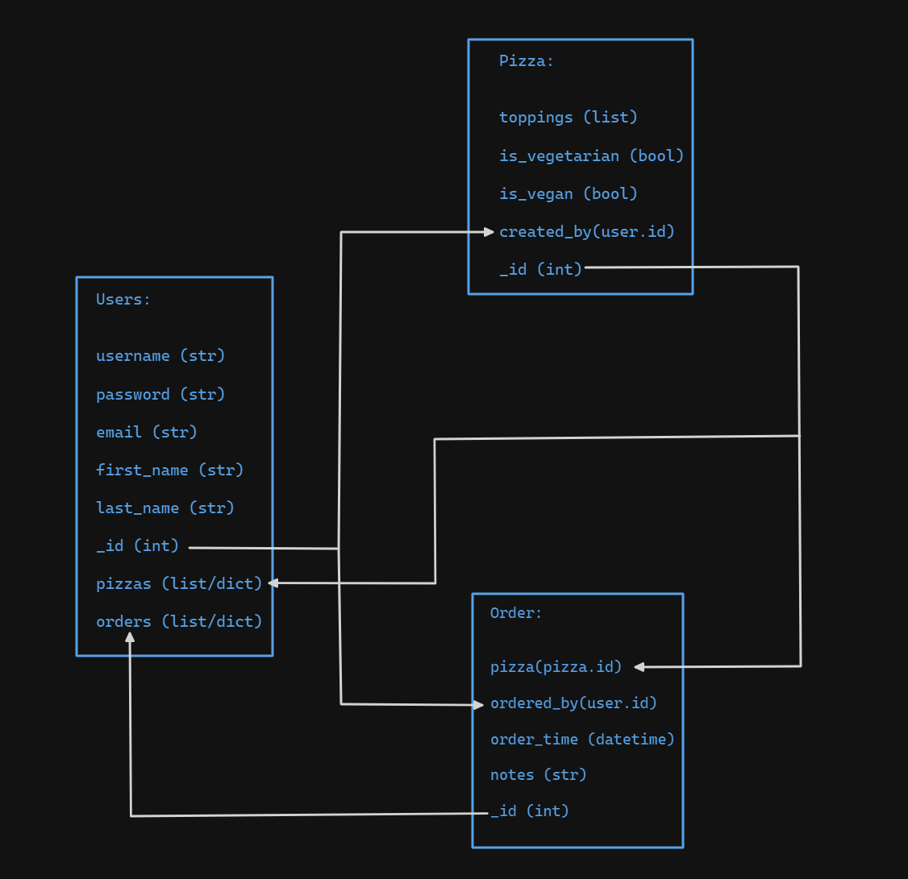
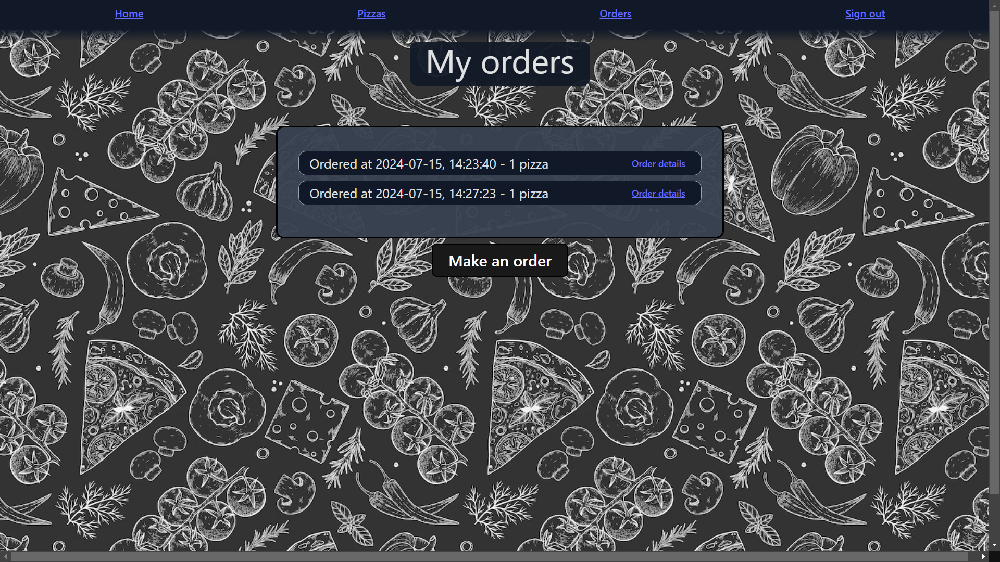

# Pizza Delivery API - deployed link [here](https://pizza-delivery-api.netlify.app/)

#### Solo project - full stack app using Django, React and PostgreSQL, made within 9 days. Users can add pizzas customisable by toppings, and orders, with one or more pizzas. Both pizzas and orders have full CRUD functionality.

### Technologies used

#### Front end:
- JSX
- React
- CSS (Tailwind)
- HTML
- React Select
- React Toastify

#### Back end:
- Python
- Django
- Django REST framework
- PostgreSQL
- pyjwt
- psycopg2



---

### Brief

- The app uses Django to render templates to users.
- PostgreSQL is used as your database management system.
- The app uses Django for session-based authentication.
- Implement authorisation - guests (users not signed in) must only be able to read data and not create, update or delete.
- The app must have at least one data entity as well as the User model, and at least one data entity must be related to the User model.
- Full CRUD functionality.
- App is deployed online.

---

### Code installation

#### Back end:

Run `pipenv install` to install dependencies.

Run `python manage.py loaddata pizzas/seeds.json` to load data for pizzas and toppings into the database. Note that you will not be able to load data for orders, as these require user IDs, which have not been dumped in a `seeds.json` file. You can still make users and your own orders though!

Run `python manage.py runserver` to run the app.

#### Front end:

Run `npm i` to install dependencies.

Run `npm run dev` to run the app.

---

### Planning

I created a **Trello** board (located [here](https://trello.com/b/rlTTfa8D/project-4-plan)) for this project. My wireframe and ERD can be seen below.




---

### Build process

I began with the command `django-admin startproject project` to create a foundation for all my data apps to run from.

The first data I wanted to work on was pizzas, so I ran the command `django-admin startapp pizzas`, along with `python manage.py createsuperuser` to have an admin user.

Note, with every app you create, you must add it to the list of installed apps in settings.py:

```py
INSTALLED_APPS = [
    'jwt_auth',
    'django.contrib.admin',
    'django.contrib.auth',
    'django.contrib.contenttypes',
    'django.contrib.sessions',
    'django.contrib.messages',
    'django.contrib.staticfiles',
    'rest_framework',
    'pizzas',
    'orders',
    'corsheaders',
]
```

Then I created and migrated a pizza model:
```py
class Topping(models.Model):

    def __str__(self) -> str:
        return f'{self.name}'

    name = models.CharField(max_length=20, unique=True)

class Pizza(models.Model):

    def __str__(self) -> str:

        toppings_names = ", ".join([topping.name for topping in self.toppings.all()])
        return f'{toppings_names}'

    toppings = models.ManyToManyField(Topping, related_name="pizzas")
    is_vegetarian = models.BooleanField()
    is_vegan = models.BooleanField()
    owner = models.ForeignKey(
        "jwt_auth.User",
        related_name="pizzas",
        on_delete= models.CASCADE
    )
```

The topping model was created to add a preset list of toppings that can later be added by ID as a list of toppings on your pizzas.

With models, I also created serializers. Below is the serializer for pizzas:

```py
# serializers.common

from rest_framework import serializers
from ..models import Pizza, Topping

class PizzaSerializer(serializers.ModelSerializer):
    class Meta:
        model = Pizza
        fields = '__all__'

class ToppingSerializer(serializers.ModelSerializer):
    class Meta:
        model = Topping
        fields = '__all__'

# serializers.populated

from rest_framework import serializers
from .common import PizzaSerializer, ToppingSerializer
from jwt_auth.serializers import UserSerializer

class PopulatedPizzaSerializer(PizzaSerializer):
    toppings = ToppingSerializer(many=True)
    owner = UserSerializer()
```

Once I had a model and a way to show data in serializers, I could make my views for pizzas:

```py
class PizzaListView(APIView):

    permission_classes = (IsAuthenticatedOrReadOnly, )

    def get(self, _request):
        
        pizzas = Pizza.objects.all()
        serialized_pizzas = PopulatedPizzaSerializer(pizzas, many=True)
        return Response(serialized_pizzas.data, status=status.HTTP_200_OK)
    
    def post(self, request):

        pizzas = Pizza.objects.all()

        for pizza in pizzas:
           
            pizza_toppings = list(pizza.toppings.values_list('id', flat=True))
            if set(pizza_toppings) == set(request.data["toppings"]):

                raise ValidationError({"toppings": ["A pizza with these toppings already exists!"]})

        request.data["owner"] = request.user.id
        pizza_to_add = PizzaSerializer(data=request.data)

        if pizza_to_add.is_valid():

            pizza_to_add.save()
            return Response(pizza_to_add.data, status=status.HTTP_201_CREATED)
        
        return Response(pizza_to_add.errors, status=status.HTTP_422_UNPROCESSABLE_ENTITY)
    

class PizzaDetailView(APIView):

    permission_classes = (IsAuthenticatedOrReadOnly,)

    def get_pizza(self, pk): 

        try:

            return Pizza.objects.get(pk=pk)
        
        except Pizza.DoesNotExist:
            
            raise NotFound(detail="The cheese pull doesn't go that far... this pizza doesn't exist!")

    def get(self, _request, pk):

            pizza = self.get_pizza(pk=pk)
            serialized_pizza = PopulatedPizzaSerializer(pizza)
            return Response(serialized_pizza.data, status=status.HTTP_200_OK)
    
    def put(self, request, pk):
        
        pizza_to_edit = self.get_pizza(pk=pk)

        pizzas = Pizza.objects.exclude(pk=pizza_to_edit.id)

        for pizza in pizzas:
           
            pizza_toppings = list(pizza.toppings.values_list('id', flat=True))
            if set(pizza_toppings) == set(request.data["toppings"]):

                raise ValidationError({"toppings": ["A pizza with these toppings already exists!"]})

        if pizza_to_edit.owner.id != request.user.id and not (request.user.is_staff or request.user.is_superuser):
            return Response(status=status.HTTP_401_UNAUTHORIZED)

        first_owner = pizza_to_edit.owner.id
        request.data["owner"] = first_owner

        updated_pizza = PizzaSerializer(pizza_to_edit, data=request.data)

        if updated_pizza.is_valid():
            
            updated_pizza.save()
            return Response(updated_pizza.data, status=status.HTTP_202_ACCEPTED)
        
        return Response(updated_pizza.errors, status=status.HTTP_422_UNPROCESSABLE_ENTITY)
    
    def delete(self, request, pk):

        if not (request.user.is_staff or request.user.is_superuser):
            return Response(status=status.HTTP_401_UNAUTHORIZED)
       
        pizza_to_delete = self.get_pizza(pk=pk)
        pizza_to_delete.delete()
        return Response(status=status.HTTP_204_NO_CONTENT)

class ToppingListView(APIView):

    def get(self, _request):

        toppings = Topping.objects.all()
        serialized_toppings = ToppingSerializer(toppings, many=True)
        return Response(serialized_toppings.data, status=status.HTTP_200_OK)
```

For each view class, in each app, I added a corresponding URL to the app's `urls.py` file:

```py
urlpatterns = [
    path('', PizzaListView.as_view()),
    path('<int:pk>/', PizzaDetailView.as_view()),
    path('toppings/', ToppingListView.as_view())
]
```

I followed a similar process for the pizza orders app, and the `jwt_auth` app.

I then used React to configure the front end, and Tailwind for CSS.

For reference to how I pulled data from the back end and displayed it, here is the JSX file for displaying all orders.

```jsx
// src/components/MyOrders.jsx

import React from 'react'
import axios from 'axios'
import { baseUrl } from '../config'
import { Link } from 'react-router-dom'

export default function MyOrders({ isLoggedIn }) {

    const [orders, setOrders] = React.useState(null)

    React.useEffect(() => {

        async function fetchOrders() {
            const allOrders = await axios.get(`${baseUrl}/api/orders/`, {
                headers: {Authorization: `Bearer ${isLoggedIn}`}
            })
            setOrders(allOrders.data)
        }

        fetchOrders()
    }, [])

    function formatDate(date) {

        const datetime = date.split(".")[0]

        const yearmonthday = datetime.split("T")[0]
        const timestamp = datetime.split("T")[1]

        return `${yearmonthday}, ${timestamp}`

    }

  return (
    <div className='flex items-center w-dvw flex-col h-dvh'>

        <h1 className='w-fit px-6 pb-3 bg-gray-900 bg-opacity-95 rounded-xl'>My orders</h1>
        
        <div className='flex flex-col items-left mt-[4%] min-h-[20%] min-w-[30%] w-fit max-h-fit bg-gray-700 bg-opacity-95 p-8 border-[3px] border-black rounded-xl'>

            {orders && orders.map((order, index) => {
                return <div key={index} className='bg-gray-900 rounded-xl flex-row flex items-center justify-between my-1 border border-gray-400 py-1 pl-4 pr-6'>

                    <p className='text-sm pr-12 md:text-xl md:pr-32'>Ordered at {formatDate(order.time_added)} - {order.pizzas.length} {order.pizzas.length === 1 ? "pizza" : "pizzas"}</p>
                    <Link to={`/orders/${order.id}/`} className='underline text-sm'>Order details</Link>

                </div>
            })}
            {!orders && <p>Looks like you haven't made any orders yet. Let's make one now with the button below!</p>}

        </div>

        <Link className='bg-[#19191a] px-6 py-2 rounded-lg border-2 border-black hover:bg-[#b4b4b5] hover:border-black hover:text-black hover:font-bold text-white text-2xl mt-2' to={"/orders/new/"}>Make an order</Link>
    
    </div>
  )
}

```


---

### Challenges

Embedding models in Python proved very difficult as I needed a list of toppings that pizzas can have only one each of, but any amount of them (i.e. any combination of toppings, without repeats). I overcame this in the end by researching many-to-many fields and creating a `Topping` model. 

I did not initially plan to create an additional model for toppings, but I feel as though I've benefitted from this as it's allowed me to work on something new!

Error handling for this project was quite difficult for me. You might think it's because I insisted on using React Toastify, but honestly, Toastify made things a lot easier. 

The main issue with errors was handling errors with input fields as, for some reason, errors were being sent within one-dimensional and two-dimensional arrays, so a lot of trial and error went into finally finding the solution:

```jsx
// NewPizza.jsx

    async function handleSubmit(event) {

        event.preventDefault()

        try {
            const newFormData = structuredClone(formData)
            newFormData.toppings = reformatToppings()

            await axios.post(`${baseUrl}/api/pizzas/`, newFormData, {
                headers: { Authorization: `Bearer ${isLoggedIn}` }
            })
            navigate('/pizzas/')

        } catch (error) {

            console.log(error.response.data)
            const errorArray = Object.entries(error.response.data)

            errorArray.forEach(field => {

                toast.error(`${field[0]}: ${field[1][0]}`, {})
            
            })
        }

    }
```

I'm also happy with how I further pushed myself with React and Tailwind CSS, even though becoming curious about my code is more of a hobby at this point - I'll get bored if I don't learn new things as well as practice what I know!

---

### Key learnings

I loved learning a new programming language in Python, and it was also a nice confidence boost to learn it so quickly! Once you get a grasp of coding concepts in general, learning languages becomes more straightforward.

Using Django was interesting too - the built-in admin site is incredibly useful when developing as it allowed for a makeshift CRUD functionality while I got on with making it possible in the front end. Having used Express and MongoDB previously, using Django felt like a nice change, but I love using either one!

---

### Bugs

As of the time I write this README, I haven't come across any bugs, but if I find some, I'll be sure to either fix them or update this section.

---

### Future improvements

- Confirmation page for a user's order:
    - Add "price" key to pizzas, then add these up at checkout for a total
    - "Order for someone else?" option; changes the order "owner" to another user's ID

- Once an order is posted, implement feature to email user thanking them for their order

- Allow pictures of pizzas to be added to 'show' page for one pizza

## Enjoy the app! <3